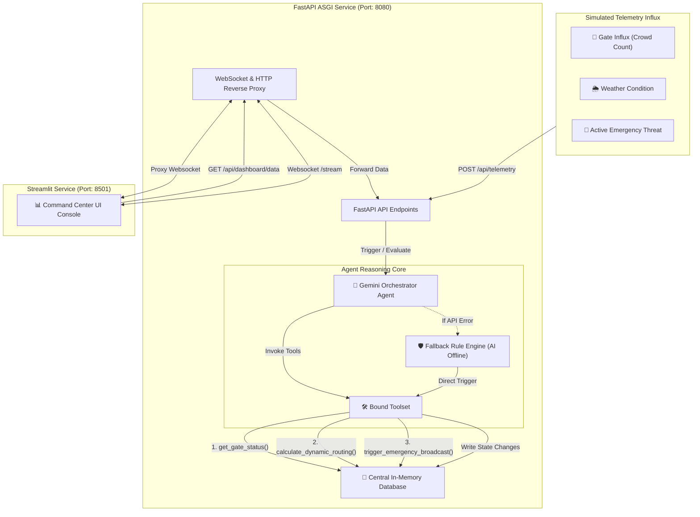

# Stadium Crowd Management & Emergency Response Orchestrator

[](https://fastapi.tiangolo.com/)
[](https://streamlit.io/)
[](https://cloud.google.com/run)
[](https://deepmind.google/technologies/gemini/)

An integrated, real-time command center and autonomous tactical response engine designed to solve crowd bottleneck crises, manage weather disruptions, and orchestrate emergency safety procedures at massive cricket tournaments.

Built for the **Google Cloud Build with AI: Agentic Premier League**.

---

## 📌 Problem & Solution Alignment

### The Threat
Massive crowd sizes at cricket stadiums create high-density bottlenecks, logistical chaos, and severe safety/security risks during pre- and post-match entries/exits.

### The Gap
Current stadium operations rely on fragmented, manual communication systems, leaving stewards, security, and volunteers unable to adapt instantly to sudden surges, unexpected weather shifts, or emerging threats.

### The Need & Solution
Our **Stadium Command & Emergency Orchestrator** unifies multi-source data streams and automates response actions through a real-time, interactive command console. It couples a robust backend api with a **Gemini-powered Autonomous Agent** that actively monitors, reasons, and responds in seconds to protect lives and deliver a seamless fan experience.

---

## 🚀 Key Features

- **🌐 Single-Port ASGI Reverse Proxy Architecture**: Standard Google Cloud Run configurations only expose a single port. Our custom reverse proxy handles both HTTP and WebSocket subprotocol handshakes, forwarding browser traffic and live Streamlit connections through a unified FastAPI gateway.
- **🤖 Autonomous Gemini Decision Agent**: Leverages `gemini-2.5-flash` via the Google AI SDK / Google Antigravity SDK to evaluate incoming telemetry, determine threat priority, execute operational tool calls, and compile structured mitigation strategies.
- **⚡ Real-Time In-Memory Central Database**: High-speed operational state tracker keeping tabs on gate utilization, meteorology data, emergency alert details, and past agent reasoning steps.
- **📢 Dynamic PA & Alert Broadcasting**: Autonomous triggers automatically publish alerts to target zones, digital displays, and PA speaker channels.
- **🛡️ Fail-Safe Fallback Rule Engine**: In the event of network disconnection or API rate limits, the system instantly engages a hardcoded stadium safety protocol engine to ensure safety commands (like emergency evacuation and routing) are always active.

---

## 🏗️ System Architecture



---

## 🛠️ Technology Stack

1. **Backend**: FastAPI (Python)
2. **Frontend**: Streamlit (Premium dark dashboard with custom CSS overrides)
3. **AI Orchestration**: Gemini API (`gemini-2.5-flash`), Google Antigravity SDK
4. **Hosting & Deployment**: Google Cloud Run (Dockerized Container via Google Artifact Registry and Cloud Build)

---

## 💻 Local Quickstart

### 1. Prerequisites
- Python 3.10+
- A Google Gemini API Key (obtain from [Google AI Studio](https://aistudio.google.com/))

### 2. Installation & Setup
Clone the repository and enter the directory:
```bash
git clone <your-repo-url>
cd FinaleGoogle
```

Create a virtual environment and install dependencies:
```bash
python3 -m venv venv
source venv/bin/activate
pip install -r requirements.txt
```

### 3. Environment Configuration
Create a `.env` file in the root directory:
```env
GOOGLE_CLOUD_PROJECT=your-gcp-project-id
GOOGLE_CLOUD_REGION=us-central1
GEMINI_API_KEY=your_gemini_api_key
```

### 4. Running Locally
Start the unified application (FastAPI & Streamlit):
```bash
chmod +x start.sh
./start.sh
```

- **Command Center Dashboard**: Visit `http://localhost:8080` in your web browser.
- **FastAPI Swagger Docs**: Visit `http://localhost:8080/docs` to see interactive API endpoints.

---

## 🧪 Running Integration Tests

We have written an end-to-end integration test suite to verify health checks, telemetry ingestion, and agent tool execution. Run it against your local or live service:

```bash
# Activate your venv if not already done
source venv/bin/activate

# Execute the tests
python tests/test_live.py
```

---

## 🚀 Google Cloud Run Deployment

To build and deploy the container to Google Cloud Run, execute the deployment script:

```bash
chmod +x deploy.sh
./deploy.sh
```

The script will automatically:
1. Enable necessary GCP services (Artifact Registry, Cloud Build, Cloud Run, Generative Language API).
2. Provision a Google Artifact Registry repository.
3. Build the Docker image via Google Cloud Build.
4. Deploy the service to Google Cloud Run with the configured `.env` parameters.
